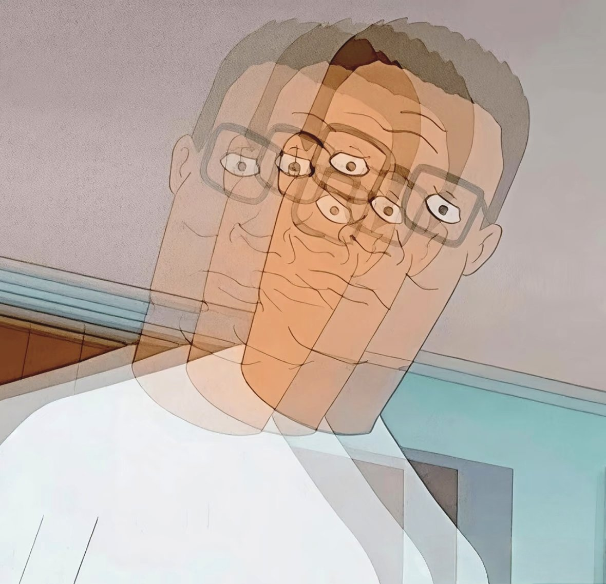
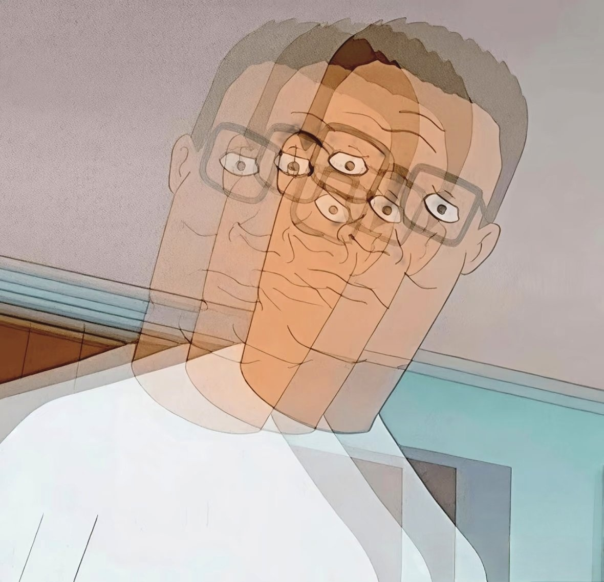

# ghost-avatar

把任意图像转成"重影/多重曝光"风格头像的小工具。也是一个 Claude Code Skill。

| Before | After |
|:---:|:---:|
|  |  |

## 原理

1. （可选）用 [rembg](https://github.com/danielgatis/rembg) 抠出前景主体
2. 把主体复制 N 份，每份水平偏移不同距离
3. 每份用递减透明度叠加回原图
4. 原始主体放最上层保持清晰

## 安装

```bash
git clone https://github.com/Qiuuc/ghost-avatar.git
cd ghost-avatar
pip install -r requirements.txt
```

> 首次运行进阶版会自动下载 rembg 模型文件（约 180MB）到 `~/.u2net/`。

## 用法

### 单张 · 简单版（只依赖 Pillow）

```bash
python scripts/ghost_effect.py input.jpg output.jpg
```

### 单张 · 进阶版（抠主体，背景不重影，推荐）

```bash
python scripts/ghost_effect_pro.py input.jpg output.jpg
```

### 批量处理整个文件夹

```bash
python scripts/batch_ghost.py 输入文件夹 输出文件夹
```

## 参数

在脚本末尾调整：

| 参数 | 说明 | 推荐范围 |
|---|---|---|
| `copies` | 重影层数（含原图） | 4–6 |
| `offset` | 每层水平偏移像素（批量脚本按图宽 % 自适应） | 30–60 px / 5%–12% |
| `base_alpha` | 重影透明度 | 0.35–0.7 |
| `direction` | `"right"` / `"left"` / `"both"` | — |
| `model` | rembg 模型：通用 `"u2net"`、人像 `"u2net_human_seg"` | — |

## 调参经验

- **卡通/描边风**图重影天然明显，参数可保守
- **写实照片**边缘柔和，offset 要加到 10% 以上才看得清
- **主体与背景反差大**重影更清楚

## 作为 Claude Code Skill 使用

此仓库根目录含 `SKILL.md`，可作为 Claude Code / Agent SDK 的 skill 被引用。把整个目录放到 `~/.claude/skills/` 下即可。

## License

[MIT](LICENSE) © [Qiuuc](https://github.com/Qiuuc)
